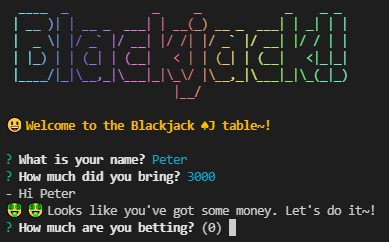
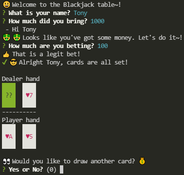
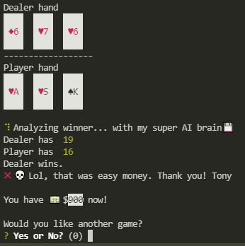
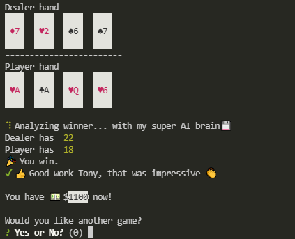

### A CLI Blackjack game with graphics

This is a text based Blackjack game that allows a single player to play against a dealer.

#### The game follows the following rules

*If the player has blackjack, they win, unless the dealer also has blackjack, in which case the game is a tie.
*If the dealer busts and the player doesn't, the player wins.
*If the player busts, the dealer wins.
*If the player and the dealer both don't bust, whoever is closest to 21 wins.

#### Packages used in this program

nanospinner, chalk, inquirer, gradient, chalkAnimation, figlet   

`$npm i chalk inquirer nanospinner gradient chalkAnimation figlet`

#### To Run

`$node index.js`

####

